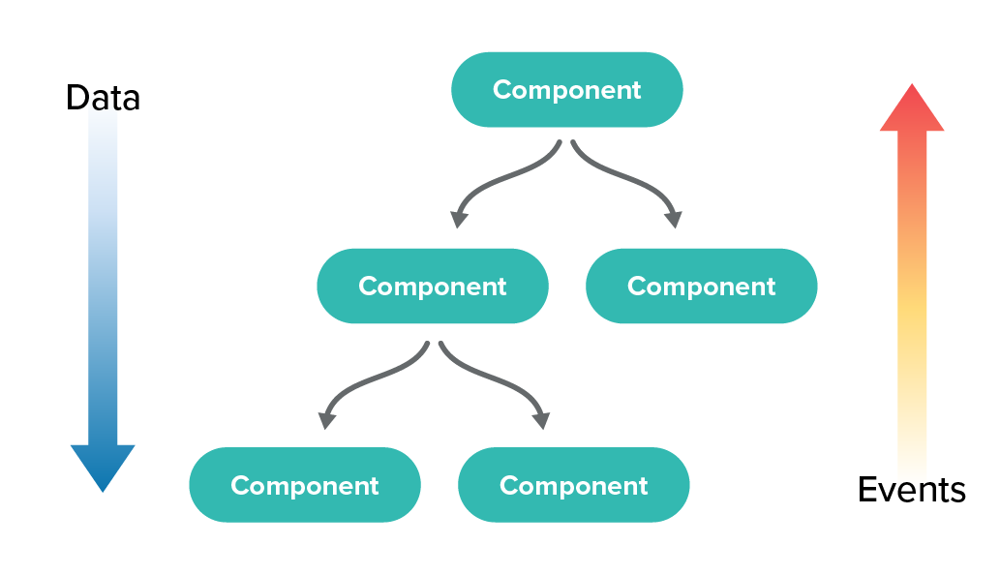

# Context


## 1. Penjelasan Context

**Context** merupakan fitur yang dimiliki react untuk melakukan distribusi data pada component tree tanpa harus melakukan passing props secara manual

## 2. Permasalahan



Dalam pengembangan aplikasi berbasis component, tidak jarang kita mempassing data yang dimiliki parent component ke child component, dan seterusnya hingga data tersebut sampai ke child component tujuan. Biasanya hal ini diselesaikan dengan menggunakan props.

Begitu juga sebaliknya, apabila ingin mengupdate data yang berada di parent component, maka child component akan mengupdatenya menggunakan event yang sudah diberikan oleh parent componentnya.

Mempassing data atau event menggunakan props seperti ini membuat kita susah untuk memprediksi lokasi data saat ini, serta memakan banyak waktu dalam penulisan koding.

## 3. Solusi

Perkenalkan fitur keren yang dimiliki react yang bernama `Context`, dengan `Context` kita bisa mendistribusikan serta mengupdate data dari parent ke child secara mudah tanpa harus menggunakan props.

`Context` memiliki dua property, yaitu `Provider` dan `Consumer`

```Javascript
const {Provider, Consumer} = React.createContext(defaultValue);
```

`Provider` merupakan component yang mendistribusikan data kepada `Consumer`

```Javascript
<Provider value={/* some value */}>
```

Sedangkan `Consumer` merupakan component yang digunakan untuk mengambil data yang disediakan oleh `Provider`

```Javascript
Consumer>
  {value => /* render something based on the context value */}
</Consumer>
```

**Untuk mempelajari lebih lanjut tentang `Context`, silahkan kunjungi link berikut :**

**Dokumentasi :** https://reactjs.org/docs/context.html

**Tutorial :** https://www.youtube.com/watch?v=XLJN4JfniH4
