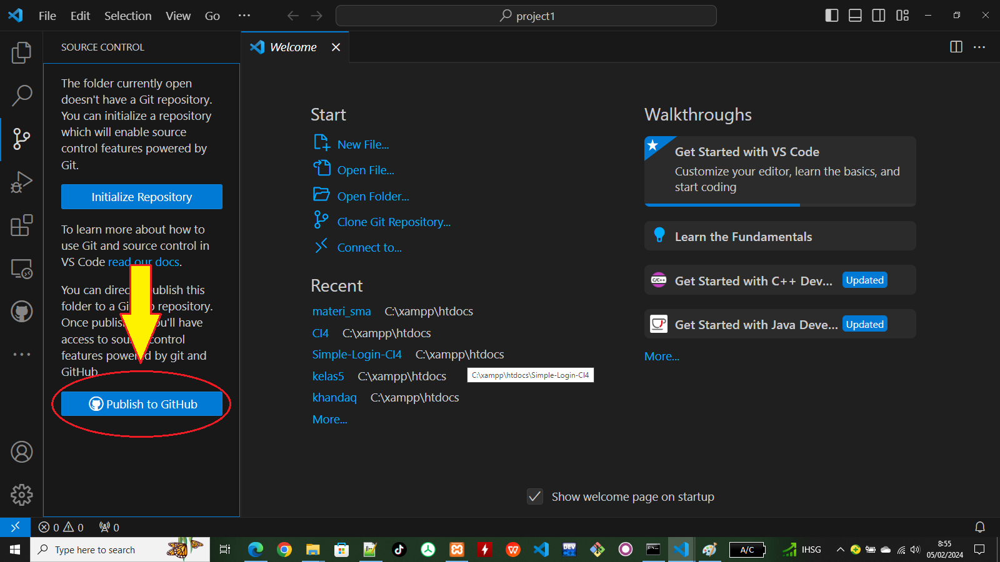
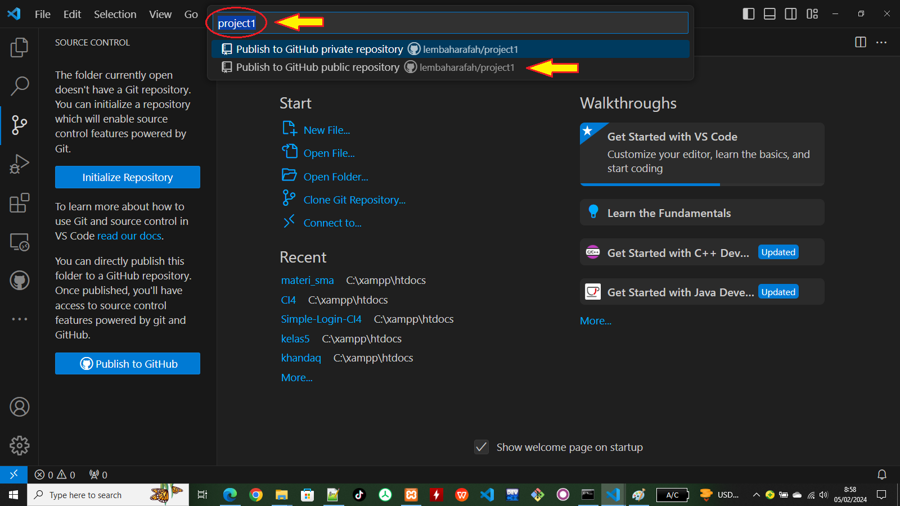

## Cara Menghubungkan VS Code dengan Github

- Buat lah direktory project

- jalankan di perintah command Prompt (di OS windows), Masuk ke root direktory dan buat direktory project1

```bash
  cd\xampp\htdocs
  mkdir project1
```

- Jalankan VS CODE di dalam directory project1...

```bash
  code .
```

- tampilan visualcode dengan home folder project1


- Klik cource control yang ada di visual code


- Klik Publish to Github



- Ketik nama repository yang akan di buat contoh Project1
- Untuk Public pilih yang public



- Pastikan user/password sudah sesuai dengan user/password github
