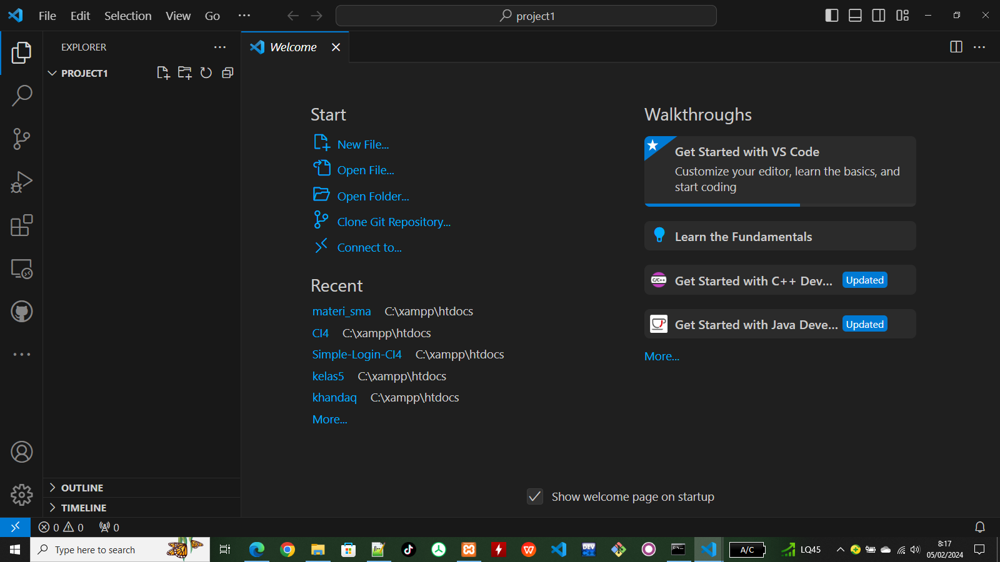
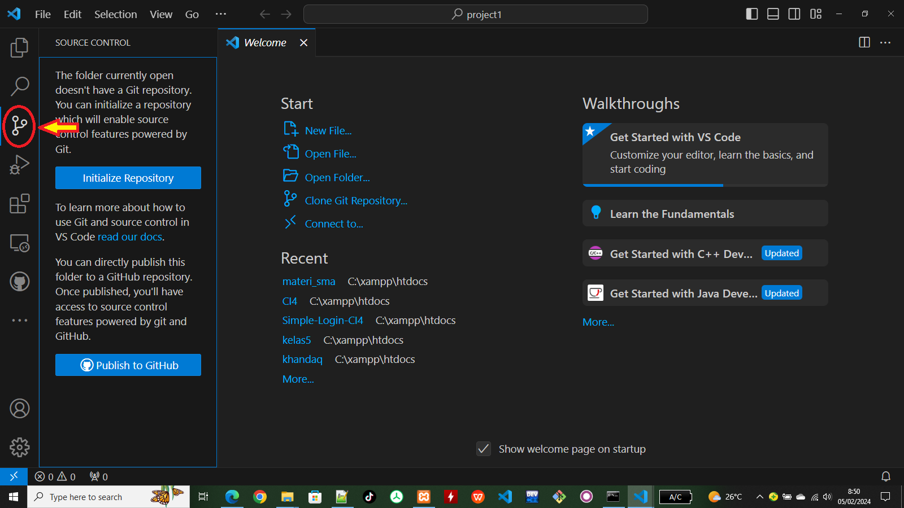

## Cara Menghubungkan VS Code dengan Github

- Buat lah direktory project

- jalankan di perintah command Prompt (di OS windows), Masuk ke root direktory dan buat direktory project1

```bash
  cd\xampp\htdocs
  mkdir project1
```

- Jalankan VS CODE di dalam directory project1...

```bash
  code .
```

- tampilan visualcode dengan home folder project1



- Klik cource control yang ada di visual code



| Parameter | Type     | Description                |
| :-------- | :------- | :------------------------- |
| `api_key` | `string` | **Required**. Your API key |

#### Get item

```http
  GET /api/items/${id}
```

| Parameter | Type     | Description                       |
| :-------- | :------- | :-------------------------------- |
| `id`      | `string` | **Required**. Id of item to fetch |

#### add(num1, num2)

Takes two numbers and returns the sum.
