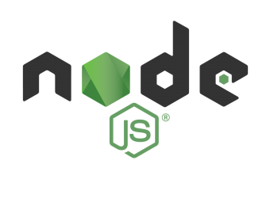

# Node.js



## 1. Permasalahan

Sebelumnya, kita sudah terbiasa dengan bahasa pemrograman Javascript untuk membuat frontend dari suatu website. Namun, untuk membuat backend kita membutuhkan bahasa pemrograman lain seperti Golang, PHP, Java, dll. Dikarenakan Javascript hanya berjalan pada sisi client atau browser saja, sehingga Javascript tidak dapat dijalankan di server. Maka NodeJS lah yang melengkapi peran dari Javascript sehingga bisa kita gunakan juga untuk sisi servernya.

## 2. Penjelasan Node.js

Agar kita dapat menjalankan javascript pada server, maka kita harus menginstall node.js pada server. Node.js bukan bahasa pemrograman baru, melainkan runtime environment atau suatu wadah dimana bahasa pemrograman dapat berjalan di dalamnya. Dalam kasus ini, node.js yang diinstall ke server membuat bahasa pemrograman javascript dapat berjalan pada server.

## 3. Install Node.js

### 3.1. Windows

Untuk Sistem Operasi Windows, anda cukup mendownload installer yang telah disediakan pada link dibawah. Untuk cara menginstallnya hampir sama seperti menginstall aplikasi pada Windows.

https://nodejs.org/en/download/

### 3.2. Ubuntu

Untuk Sistem Operasi Ubuntu lakukan langkah-langkah berikut

```bash
curl -sL https://deb.nodesource.com/setup_4.x | sudo -E bash -
sudo apt-get install -y nodejs
```

### 3.3. MacOS

Untuk Sistem Operasi MacOS anda cukup mendownload installer yang juga disediakan pada link dibawah ini. Jalankan installer seperti anda menginstall aplikasi pada umumnya.

https://nodejs.org/en/download/

## 4. Hello World

### 4.1. Membuat Script Node.js

Untuk membuat script node.js, kita membutuhkan file dengan menggunakan ekstensi `.js`, misalnya `app.js`

```javascript
// app.js

console.log('Hello World')
```

### 4.2. Menjalankan Script Node.js

Kemudian untuk menjalankan script yang telah kita buat, gunakanlah perintah `node`

```bash
node app.js
```

Maka setelah itu akan muncul pada console "Hello World" yang telah kita buat tadi.
